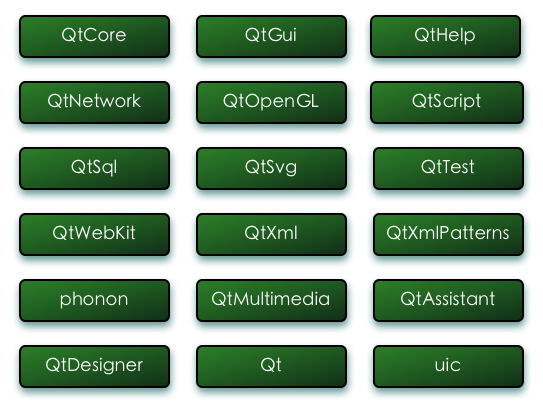

PyQt4学习

参考文档

+ [官网文档](http://pyqt.sourceforge.net/Docs/PyQt4/)
+ [也是官方文档PyQt4 APIs ](http://pyqt.sourceforge.net/Docs/PyQt4/modules.html)
+ [zetcode：良心文档每行代码都给解释](http://zetcode.com/gui/pyqt4/)
+ [zetcode中文版](http://www.qaulau.com/books/PyQt4_Tutorial/index.html)
+ [PyQt4 精彩实例](http://www.linuxidc.com/Linux/2012-06/63652.htm)
+ [一个不错的博客文章](http://blog.csdn.net/a359680405/article/details/45096185)
+ [QT参考文档：玩到最后不得不看QT了](http://www.kuqin.com/qtdocument/)
+ [QT designer文档](http://doc.qt.io/qt-4.8/designer-manual.html)
+ [PySide文档](http://wiki.qt.io/Category:LanguageBindings::PySide)
+ [汇总](https://segmentfault.com/a/1190000005165656)
+ http://www.rkblog.rk.edu.pl/w/p/simple-text-editor-pyqt4/
+ https://github.com/shuge/Qt-Python-Binding-Examples
+ https://github.com/jimmykuu/PyQt-PySide-Cookbook

##主要内容

+ QtCore：核心的非GUI功能，对时间、文件、目录、各种数据类型、流、网址、媒体类型、线程或进程进行处理

+ QtGui：图形化窗口组件和及相关类。包括如按钮、窗体、状态栏、滑块、位图、颜色、字体等等

+ QtHelp：包含了用于创建和查看可查找的文档的类

+ QtNetwork：包括网络编程的类。用来编写TCP/IP和UDP的客户端和服务器

+ QtOpenGL：使用OpenGL库来渲染3D和2D图形

+ QtScript：包含了使PyQt应用程序使用JavaScript解释器编写脚本的类

+ QtSql：提供操作数据库的类

+ QtSvg：提供了显示SVG文件内容的类。可缩放矢量图形(SVG)

+ QtTest：包含了对PyQt应用程序进行单元测试的功能

+ QtWebKit：实现了基于开源浏览器引擎WebKit的浏览器引擎

+ QtXml：处理XML文件的类，该模块提供了SAX和DOM API的接口

+ QtXmlPatterns：包含的类实现了对XML和自定义数据模型的XQuery和XPath的支持

+ phonon：包含的类实现了跨平台的多媒体框架，可以在PyQt应用程序中使用音频和视频内容

+ QtMultimedia：提供了低级的多媒体功能，通常更多使用 phonon 模块

+ QtAssistant：包含的类允许集成 Qt Assistant 到PyQt应用程序中，提供在线帮助。

+ QtDesigner：包含的类允许使用PyQt扩展 Qt Designer 。

+ Qt：综合了上面描述的模块中的类到一个单一的模块中。

##Icons
https://www.zhihu.com/question/19857245

+ [图标工厂](http://iconfactory.com/freeware) 
+ [独眼图标搜索](http://www.iconfinder.com/) 
+ [极限主题的图标区域](http://bbs.themex.net/showthread.php?t=16839403) 
+ [The Noun Project](http://thenounproject.com/ )
+ [deviantart的图标区](http://browse.deviantart.com/customization/icons/os/mac/) 
+ [icon8](https://icons8.com/)
+ [flaticon](http://www.flaticon.com/)
+ [androidicons](http://www.androidicons.com/)
+ [iconarchive](http://www.iconarchive.com/)
+ [Iconfont-阿里巴巴矢量图标库](http://iconfont.cn/)
+ [icomoon](https://icomoon.io/app/)
+ http://www.veryicon.com/
+ http://www.easyicon.net/
+ https://www.iconfinder.com/
+ https://design.google.com/icons/

##Tiny Projects Plan

+ 科学计算器
+ RESTful API测试工具
+ 视频下载器/下载器
+ 文本编辑器/代码编辑器
+ 桌面数据爬虫
+ 数据分析平台
